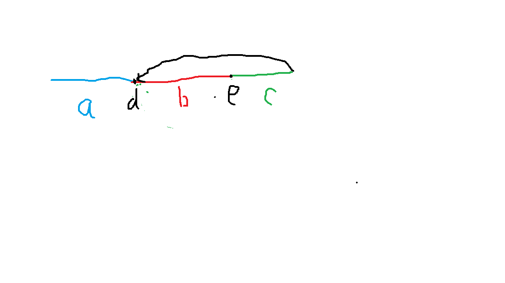

# 142. 环形链表 II
给定一个链表，返回链表开始入环的第一个节点。 如果链表无环，则返回 null。

为了表示给定链表中的环，我们使用整数 pos 来表示链表尾连接到链表中的位置（索引从 0 开始）。 如果 pos 是 -1，则在该链表中没有环。

说明：不允许修改给定的链表。

示例 1：

输入：head = [3,2,0,-4], pos = 1
输出：tail connects to node index 1
解释：链表中有一个环，其尾部连接到第二个节点。

示例 2：

输入：head = [1,2], pos = 0
输出：tail connects to node index 0
解释：链表中有一个环，其尾部连接到第一个节点。

示例 3：

输入：head = [1], pos = -1
输出：no cycle
解释：链表中没有环。
 

进阶：
你是否可以不用额外空间解决此题？

# 用例
```

```


# 题解
没有环时，返回空
有环时，返回末尾指针指向的节点

## 快慢指针

快慢指针同一位置开始，slow跑1，fast跑2



看图，d点为循环节点，即为所求

e点为两指针相遇点，此时，slow跑了a+b距离，fast跑了a+b+n*(b+c)

而fast两倍速，所以

2*(a+b) = a+b+n(b+c)
a = c + (n-1)b+c

c + （n-1) b+c
可理解为在循环内跑了n-1圈，多少圈不用在意，再额外跑了c的距离
如果从e点开始，此时会刚好再d点

所以 当两指针相遇时，在设指针ptr在head，步速1，与slow一致，当两指针相遇，即为a的距离，此时为d点。


