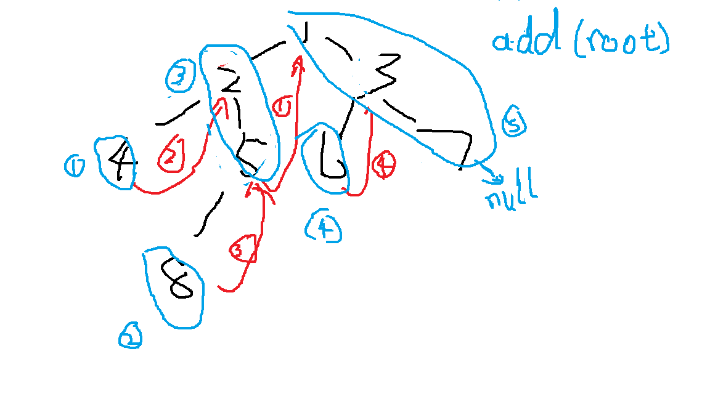

# 145 二叉树的后序遍历
Category	Difficulty	Likes	Dislikes
algorithms	Medium (73.11%)	441	-
Tags
Companies

给定一个二叉树，返回它的 后序 遍历。

示例:

输入: [1,null,2,3]  
   1
    \
     2
    /
   3 

输出: [3,2,1]
进阶: 递归算法很简单，你可以通过迭代算法完成吗？

# 用例

# 题解

## 递归
posterTraversal(left)
posterTraversal(right)
exeNode()

## 栈模拟
1. 先找最左节点，路过左节点依次入栈

2. 如果左节点空，
   1. 右节点不空，入栈并移到右节点，返回1
   2. 右节点空，抵达最底层最左节点，处理，移到栈顶

3. 移到栈顶后
    1. 如果右节点不空，入栈并移动，返回1
    2. 如果右节点空，抵达最底层，处理，移到栈顶

4. 移到栈顶后，如果右节点等于上一栈顶，循环弹出。直到不等于，返回3
   1. 如果栈顶空，已抵达跟节点，跳出大循环

while(node){
// 1
while(node->left){
    stk.push(node);
    node = node->left;
}
// 2
if(node->right){
    // 2.1
    stk.push(node);
    node = node->right;
}else{
    // 2.2
    exe(node);
    node = stk.top();
    // 3
    while(node){
        if(node->right){
            node = node->right;
        }else{
            // 3.2
            exe(node);
            node = stk.top();
            // 4
            while(lnode==node->right){
                lnode = node;
                stk.pop;
                node = stk.top;
            }
            if(node->right)
            node = node->right
        }
    }
}
}

## moris遍历魔改

moris原版是中序遍历

1. 查找当前左子树的最右节点

2. 移到左子树，重复1

3. 当左节点空，即抵达最左节点，处理，移到右，根据1，会返回上一节点，并取消刚才的链接

4. 处理当前节点，移到右。重复1

如果是后序遍历 左右中

1. 查找当前节点左子树的最右节点，链接到当前节点

2. 移到左子树，重复1

完成如图红色1，2的尾端链接

3. 当左节点空，即抵达最左节点，移到右，根据1，会返回上一节点

4. 抵达上一节点后，再次遍历发现左子树的最左节点已经链接，此时取消链接，依次倒序遍历左子树的右节点，移到右，重复1

两者区别

中序取消链接时可以直接处理当前根节点，  
后序则是返回根节点后，倒序依次遍历左节点的右节点

