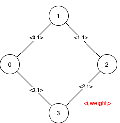

# 1489. 找到最小生成树里的关键边和伪关键边
给你一个 n 个点的带权无向连通图，节点编号为 0 到 n-1 ，同时还有一个数组 edges ，其中 edges[i] = [fromi, toi, weighti] 表示在 fromi 和 toi 节点之间有一条带权无向边。最小生成树 (MST) 是给定图中边的一个子集，它连接了所有节点且没有环，而且这些边的权值和最小。

请你找到给定图中最小生成树的所有关键边和伪关键边。如果从图中删去某条边，会导致最小生成树的权值和增加，那么我们就说它是一条关键边。伪关键边则是可能会出现在某些最小生成树中但不会出现在所有最小生成树中的边。

请注意，你可以分别以任意顺序返回关键边的下标和伪关键边的下标。

 

示例 1：


输入：n = 5, edges = [[0,1,1],[1,2,1],[2,3,2],[0,3,2],[0,4,3],[3,4,3],[1,4,6]]
输出：[[0,1],[2,3,4,5]]
解释：上图描述了给定图。
下图是所有的最小生成树。


注意到第 0 条边和第 1 条边出现在了所有最小生成树中，所以它们是关键边，我们将这两个下标作为输出的第一个列表。
边 2，3，4 和 5 是所有 MST 的剩余边，所以它们是伪关键边。我们将它们作为输出的第二个列表。

示例 2 ：



输入：n = 4, edges = [[0,1,1],[1,2,1],[2,3,1],[0,3,1]]
输出：[[],[0,1,2,3]]
解释：可以观察到 4 条边都有相同的权值，任选它们中的 3 条可以形成一棵 MST 。所以 4 条边都是伪关键边。
 

提示：

2 <= n <= 100
1 <= edges.length <= min(200, n * (n - 1) / 2)
edges[i].length == 3
0 <= fromi < toi < n
1 <= weighti <= 1000
所有 (fromi, toi) 数对都是互不相同的。


# 用例
```
5
[[0,1,1],[1,2,1],[2,3,2],[0,3,2],[0,4,3],[3,4,3],[1,4,6]]
4
[[0,1,1],[1,2,1],[2,3,1],[0,3,1]]
```

# 题解

## 并查集 暴力枚举

先构建最小生成树，记录min权值value

- 关键边
省略该边构建最小生成树时，连通量大于1或者权值v大于value
证明是关键边

- 伪关键边
先加入该边，然后构建最小生成树，v==value时
证明是伪关键边


## Tarjan找桥边

假设已经处理完权值小于w的所有边，现在要处理权值等于w的边。

视同一个连通量的集合为一个点，引入3个概念

- 自环边，加入后不改变不同连通量的连通性，由于不构成连通性，构建过程会自动省略该边
- 桥边，删掉后会导致连通数+1。即为关键边
- 非桥边，删掉后不会导致影响连通性。即为非关键边

非桥边与自环边的区别。
由于按权值大小顺序构建树，那么非桥边的权值比自环边的权值小。
所以
对于自环边，parent[x]==parent[y]，不允许加入tarjan集合
对于非桥边，parent[x]==parent[y]，允许加入tarjan集合

每次用小于w的边构建成图G时，都要针对这个gn个点的图G找一次桥边

