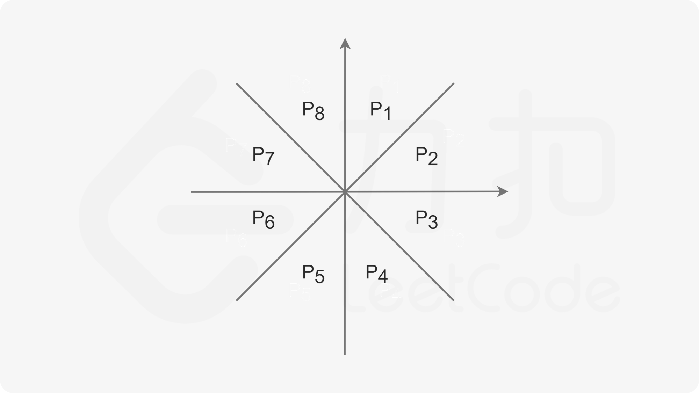

# 1584. 连接所有点的最小费用
给你一个points 数组，表示 2D 平面上的一些点，其中 points[i] = [xi, yi] 。

连接点 [xi, yi] 和点 [xj, yj] 的费用为它们之间的 曼哈顿距离 ：|xi - xj| + |yi - yj| ，其中 |val| 表示 val 的绝对值。

请你返回将所有点连接的最小总费用。只有任意两点之间 有且仅有 一条简单路径时，才认为所有点都已连接。

示例 1：


输入：points = [[0,0],[2,2],[3,10],[5,2],[7,0]]
输出：20
解释：


我们可以按照上图所示连接所有点得到最小总费用，总费用为 20 。
注意到任意两个点之间只有唯一一条路径互相到达。
示例 2：

输入：points = [[3,12],[-2,5],[-4,1]]
输出：18
示例 3：

输入：points = [[0,0],[1,1],[1,0],[-1,1]]
输出：4
示例 4：

输入：points = [[-1000000,-1000000],[1000000,1000000]]
输出：4000000
示例 5：

输入：points = [[0,0]]
输出：0
 

提示：

1 <= points.length <= 1000
-106 <= xi, yi <= 106
所有点 (xi, yi) 两两不同。

# 用例
```
[[0,0],[2,2],[3,10],[5,2],[7,0]]
[[3,12],[-2,5],[-4,1]]
[[0,0],[1,1],[1,0],[-1,1]]
[[-1000000,-1000000],[1000000,1000000]]
[[0,0]]
```
# 题解

## Kruskal 算法

简单的并查集算法

## Kruskal 建图优化




主要是为了减少边，以当前点A为原点，将区域划分为8块，

1. 防止重复，只操作p1 p2 p3 p4
2. 每个区域只连接距离最短的

不用担心连不到，总会连到的
