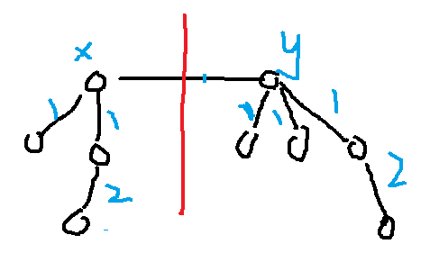

# 834. 树中距离之和
给定一个无向、连通的树。树中有 N 个标记为 0...N-1 的节点以及 N-1 条边 。

第 i 条边连接节点 edges[i][0] 和 edges[i][1] 。

返回一个表示节点 i 与其他所有节点距离之和的列表 ans。

示例 1:

输入: N = 6, edges = [[0,1],[0,2],[2,3],[2,4],[2,5]]
输出: [8,12,6,10,10,10]
解释: 
如下为给定的树的示意图：
  0
 / \
1   2
   /|\
  3 4 5

我们可以计算出 dist(0,1) + dist(0,2) + dist(0,3) + dist(0,4) + dist(0,5) 
也就是 1 + 1 + 2 + 2 + 2 = 8。 因此，answer[0] = 8，以此类推。
说明: 1 <= N <= 10000

# 用例
```
6
[[0,1],[0,2],[2,3],[2,4],[2,5]]
```

# 题解

先求出ans[0] = 1 + 1 + 2 + 2 +2 =8

而ans[1] = 1 + (1+2+2+2)+4 = 1到0的距离 + 0的右侧距离和 + 0的右侧包括自己的点数


依次类推
ans[2]可根据ans[0]获取，以2和0之间的线划分

ans[2] = (1 + 2) + 1 + (2 + 2 + 2) = 0左侧距离和 + 0左侧点数 + 2到0的距离 + 2右侧点数



如图，设dx为左侧的距离和,dy为右侧距离和，cx为左侧点数，cy为右侧点数

可得，dx = 4，dy = 5，cx = 4, cy = 5

ans(x) = dx + dy + cy = 4 + 5 + 5 = 14

ans(y) = dx + dy + cx = 4 + 5 + 4 = 13

ans(y) = ans(x) + cx - cy

手算可知符合

所以先求得ans[0]再根据d0 d1 c1 可得出ans[1]

所以

1. 先遍历记录一遍各节点的子节点，比如ans[1]和ans[2]根据ans[0]求得，所以1,2是0的。同理，1没有子节点，2的子节点是3,4,5

2. 计算ans[0]

3. 根据子节点表计算其他节点

list
0   1,2
1   
2   3,4,5
3
4
5

ans1 = 8 + 

> https://www.youtube.com/watch?v=gi2maECPOB0&ab_channel=M.C%E7%B1%B3%E5%BC%80%E6%9C%97%E5%9F%BA%E7%BD%97