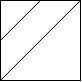

# 959. 由斜杠划分区域
在由 1 x 1 方格组成的 N x N 网格 grid 中，每个 1 x 1 方块由 /、\ 或空格构成。这些字符会将方块划分为一些共边的区域。

（请注意，反斜杠字符是转义的，因此 \ 用 "\\" 表示。）。

返回区域的数目。

 

示例 1：

输入：
[
  " /",
  "/ "
]
输出：2
解释：2x2 网格如下：


示例 2：

输入：
[
  " /",
  "  "
]
输出：1
解释：2x2 网格如下：


示例 3：

输入：
[
  "\\/",
  "/\\"
]
输出：4
解释：（回想一下，因为 \ 字符是转义的，所以 "\\/" 表示 \/，而 "/\\" 表示 /\。）
2x2 网格如下：


示例 4：

输入：
[
  "/\\",
  "\\/"
]
输出：5
解释：（回想一下，因为 \ 字符是转义的，所以 "/\\" 表示 /\，而 "\\/" 表示 \/。）
2x2 网格如下：


示例 5：

输入：
[
  "//",
  "/ "
]
输出：3
解释：2x2 网格如下：


 

提示：

1 <= grid.length == grid[0].length <= 30
grid[i][j] 是 '/'、'\'、或 ' '。

# 用例
```
[" /","/ "]
[" /","  "]
["\\/","/\\"]
["/\\","\\/"]
["//","/ "]
["\\"]
["/"]
["////","////","////","////"]
```
这里提交会识别不了反斜杠

# 题解

## 并查集

将一个区块分为 上0，右1，下2，左3 四块。

- `/`对0 3 合并，并和左边的1，上边的2合并。对1 2合并。
- `\\`对0 1 合并，并和上边的2。对2 3合并，并和左边的 1
- ` `对0 1 2 3合并，并和左边的1，上边的2